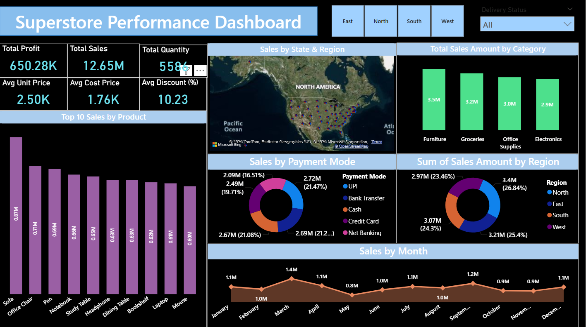
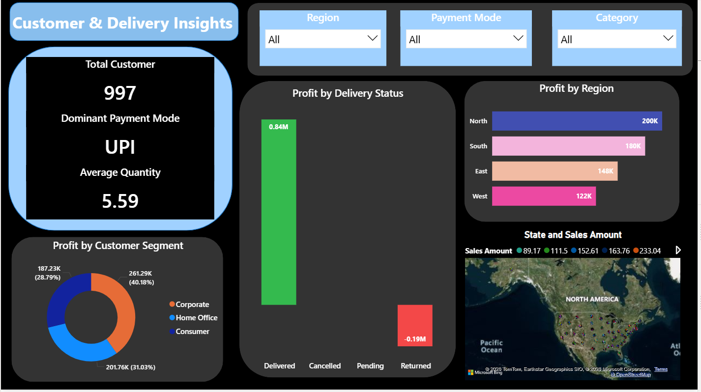
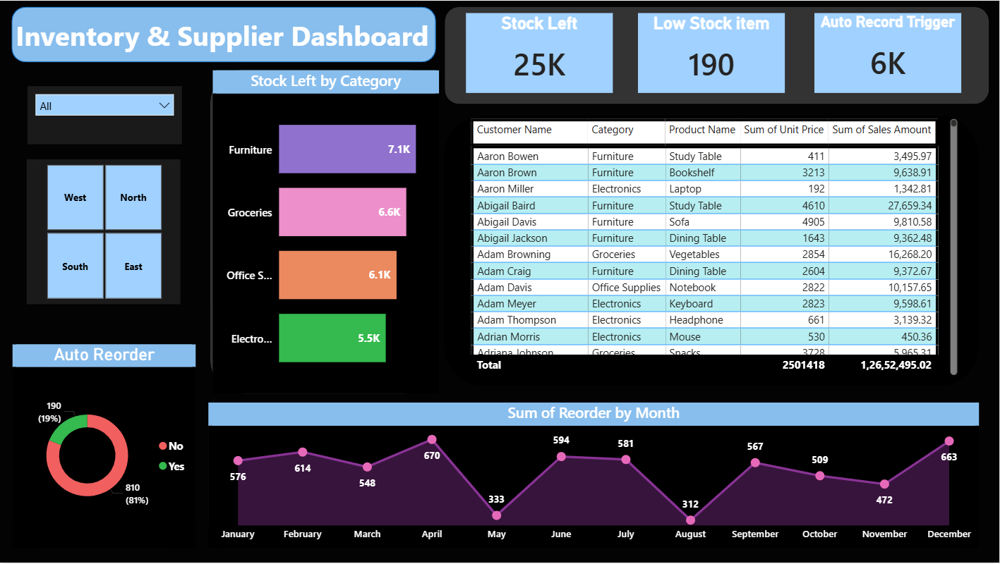

# 🛒 Superstore Business Analytics using Python and Power BI


---

## 📌 Project Overview

This project presents an **end-to-end business analytics solution** for a fictional US-based superstore covering sales performance, customer behavior, inventory monitoring, supplier tracking, and delivery performance.

The project combines:
- 🐍 **Python** — Synthetic data generation & Exploratory Data Analysis
- 📊 **Power BI** — 3 interactive business intelligence dashboards
- ☁️ **Power BI Service** — Cloud deployment for online access & sharing

> The dataset was fully generated using Python and analyzed in Power BI to produce business insights across multiple operational areas.

---

## 🎯 Project Objectives

This project answers key business questions such as:

- Which product categories generate the highest sales?
- Which region contributes the highest profit?
- Which payment mode is most preferred by customers?
- How does delivery status impact profitability?
- Which products require auto reorder based on stock levels?
- Which customer segments contribute the most profit?

---

## 📊 Dashboard Screenshots

### 1. Superstore Performance Dashboard


### 2. Customer & Delivery Insights


### 3. Inventory & Supplier Dashboard


---

## 🛠️ Tools & Technologies

| Tool | Purpose |
|---|---|
| Python 3.8+ | Core programming language |
| Pandas | Data manipulation and analysis |
| NumPy | Numerical computations |
| Faker | Synthetic data generation |
| Jupyter Notebook | Exploratory data analysis |
| Power BI Desktop | Dashboard development |
| Power BI Service | Cloud publishing & sharing |
| DAX | Power BI calculated measures |

---

## ⚙️ Installation & Setup

### Step 1 — Clone the Repository
```bash
git clone https://github.com/yourusername/superstore-business-analytics.git
cd superstore-business-analytics
```

### Step 2 — Install Dependencies
```bash
pip install pandas numpy faker jupyter
```

### Step 3 — Generate Dataset
```bash
python python/data_generator.py
```
Expected output:
```
Dataset generated and saved successfully! File saved as 'Superstore_Management_Dataset.csv'
```

### Step 4 — Run EDA Notebook
```bash
jupyter notebook python/EDA_Superstore.ipynb
```

### Step 5 — Open Power BI Dashboard
1. Open `powerbi/superstore_analysis.pbix` in Power BI Desktop
2. Click **Home → Refresh** to load the latest CSV data
3. Explore all 3 dashboard pages using the slicers

---

## 📁 Project Structure

```
superstore-business-analytics-python-powerbi/
│
├── dataset/
│   ├── Superstore_Management_Dataset.csv     ← Generated dataset (1000 rows)
│   └── superstore_analysis_results.csv       ← EDA output results
│
├── python/
│   ├── data_generator.py                     ← Synthetic data generator script
│   └── EDA_Superstore.ipynb                  ← Exploratory Data Analysis notebook
│
├── powerbi/
│   └── superstore_analysis.pbix              ← Power BI dashboard file
│
├── screenshots/
│   ├── superstore_performance_dashboard.png
│   ├── customer_delivery_insights.png
│   └── inventory_supplier_dashboard.png
│
└── README.md
```

---

## 📋 Dataset Description

The dataset contains **1,000 orders** with **25 columns** generated using Python:

| Column | Description |
|---|---|
| Order ID | Unique order identifier (ORD1000–ORD1999) |
| Order Date | Date order was placed (last 2 years) |
| Ship Date | Shipment date (1–7 days after order) |
| Customer Name | Full name of customer |
| Customer ID | Unique customer ID |
| Customer Segment | Consumer / Corporate / Home Office |
| Category | Furniture / Office Supplies / Electronics / Groceries |
| Product Name | Name of the ordered product |
| Region | North / South / East / West |
| State | US State |
| City | US City |
| Quantity | Units ordered (1–10) |
| Unit Price | Selling price per unit ($100–$5000) |
| Discount (%) | Discount applied: 0, 5, 10, 15, or 20% |
| Sales Amount | quantity × unit_price × (1 - discount/100) |
| Cost Price | Per-unit cost (50%–90% of unit price) |
| Profit | Based on delivery status (see Business Logic) |
| Stock Left | Remaining inventory (0–50 units) |
| Auto Reorder | Yes if stock < 10, else No |
| Reorder Quantity | Units to reorder (20–50 if Yes, else 0) |
| Supplier Name | Supplier company name |
| Supplier Email | Supplier contact email |
| Payment Mode | Credit Card / UPI / Cash / Bank Transfer / Net Banking |
| Delivery Status | Delivered / Pending / Cancelled / Returned |

---

## 💡 Key Business Logic

### Profit Calculation by Delivery Status

```python
base_profit = (unit_price - cost_price) * quantity * (1 - discount / 100)

if delivery == "Delivered":
    profit = base_profit              # ✅ Full profit earned

elif delivery == "Pending":
    profit = 0.0                      # ⏳ Revenue not yet recognized

elif delivery == "Cancelled":
    profit = 0.0                      # ❌ No transaction occurred

elif delivery == "Returned":
    profit = -(base_profit * 0.1 to 0.3)   # 🔄 Loss due to refund
```

### Auto Reorder Logic

```python
if stock_left < 10:
    auto_reorder = "Yes"
    reorder_quantity = random.randint(20, 50)
else:
    auto_reorder = "No"
    reorder_quantity = 0
```

---

## 📈 Power BI Dashboards

### Dashboard 1 — Superstore Performance Dashboard
> Overall sales and financial performance overview

**KPI Cards:** Total Sales · Total Profit · Total Quantity · Avg Unit Price · Avg Cost Price · Avg Discount

**Visuals:**
- Top 10 Products by Sales (Bar Chart)
- Sales by State & Region (Map)
- Total Sales by Category (Bar Chart)
- Sales by Payment Mode (Donut Chart)
- Sales Amount by Region (Donut Chart)
- Monthly Sales Trend (Line Chart)

**Key Insights:**
- 🏆 Furniture is the top-selling category (3.5M in sales)
- 🌍 North region leads in revenue (3.4M)
- 💳 UPI and Net Banking are the most preferred payment modes
- 📅 February and April show peak sales months

---

### Dashboard 2 — Customer & Delivery Insights
> Customer behavior and delivery performance analysis

**KPI Cards:** Total Customers · Dominant Payment Mode · Average Quantity

**Visuals:**
- Profit by Delivery Status (Bar Chart)
- Profit by Customer Segment (Donut Chart)
- Profit by Region (Bar Chart)
- State and Sales Amount (Map)

**Key Insights:**
- ✅ Delivered orders generate the highest profit (0.84M)
- 🔄 Returned orders show negative profit (-0.19M) — realistic business behavior
- ⏳ Pending and Cancelled orders contribute zero profit — correct behavior
- 👥 Corporate segment leads in total profit contribution (40%)

---

### Dashboard 3 — Inventory & Supplier Dashboard
> Stock levels, reorder intelligence, and supplier tracking

**KPI Cards:** Stock Left · Low Stock Items · Auto Reorder Trigger

**Visuals:**
- Stock Left by Category (Bar Chart)
- Auto Reorder Distribution (Donut Chart)
- Monthly Reorder Trend (Line Chart)
- Customer Product Sales Table

**Key Insights:**
- 📦 Furniture has the highest remaining stock (7.1K units)
- ⚠️ 190 low-stock items require immediate reorder attention
- 🔁 19% of products have auto reorder triggered
- 📅 April and May show the highest reorder demand

---

## 📐 Key DAX Measures

```DAX
-- Total Sales
Total Sales = SUM('Superstore'[Sales Amount])

-- Total Profit
Total Profit = SUM('Superstore'[Profit])

-- Average Quantity
Average Quantity = AVERAGE('Superstore'[Quantity])

-- Total Customers
Total Customers = DISTINCTCOUNT('Superstore'[Customer ID])

-- Stock Left
Stock Left = SUM('Superstore'[Stock Left])

-- Low Stock Items
Low Stock Items = COUNTROWS(FILTER('Superstore', 'Superstore'[Stock Left] < 10))
```

---

## 🔍 Key Findings

| # | Finding | Result |
|---|---|---|
| 1 | Top selling category | Furniture (3.5M) |
| 2 | Dominant payment mode | UPI |
| 3 | Highest profit region | North (200K) |
| 4 | Returned orders profit | -0.19M (negative ✅) |
| 5 | Low stock items | 190 items |
| 6 | Auto reorder rate | 19% of products |
| 7 | Average order quantity | 5.59 units |
| 8 | Avg Cost vs Unit Price | 1.76K vs 2.50K (healthy margin ✅) |
| 9 | Peak sales months | February & April |
| 10 | Cancelled & Pending profit | 0 (correct ✅) |

---

## ☁️ Power BI Service Deployment

The dashboard has been published to Power BI Service for cloud access.

**View Live Dashboard:** [https://app.powerbi.com/groups/b9cc1061-396a-4d50-8f0e-50d72ef5750c/reports/7501c395-9149-4c8a-9ad0-181cfcd663e5/8d7d6b75cabea856ce48?experience=power-bi] 


Power BI Service enables:
- 🌐 Online dashboard access from any device
- 🔗 Easy report sharing with stakeholders
- 🔄 Scheduled data refresh capability
- 📱 Mobile-friendly dashboard viewing
- 👔 Executive-level presentation ready

---

## 🚀 Future Improvements

- [ ] Add SQL database integration instead of CSV
- [ ] Add time-series forecasting model (Prophet / ARIMA)
- [ ] Add customer churn prediction using Machine Learning
- [ ] Add supplier risk scoring system
- [ ] Add RFM (Recency, Frequency, Monetary) customer analysis
- [ ] Connect live data source to Power BI for real-time refresh

---

## 👤 Author

**Abhishek Kumar**

[](https://linkedin.com/in/abhishek-kumar-a53b46309)
[](https://github.com/abhi14324)
[](mailto:ak38022246637@gmail/com)

---

## 📄 License

This project is open source and available under the [MIT License](LICENSE).

---

> ⭐ If you found this project helpful, please give it a star on GitHub!
